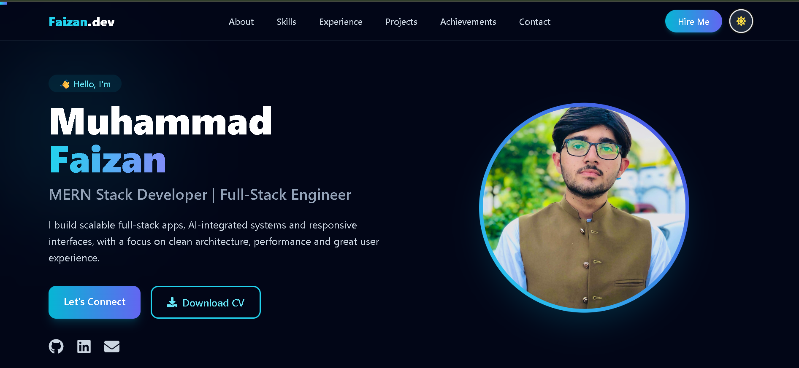

# 🚀 Muhammad Faizan | Developer Portfolio

A modern, responsive personal portfolio showcasing my projects, work experience, skills and achievements. Built with **React**, **Tailwind CSS** and **Framer Motion**, with a polished light (white + sky blue) and dark (slate + cyan) theme.

🔗 **Live Demo:** `https://portfolio-site-to-show-case-my-skil.vercel.app/` <!-- replace after deploying -->

 <!-- add a screenshot here -->

---

## 📚 Table of Contents

- [Features](#-features)
- [Tech Stack](#-tech-stack)
- [Sections](#-sections)
- [Project Structure](#-project-structure)
- [Getting Started](#-getting-started)
- [Customization](#-customization)
- [Dark Mode Setup](#-dark-mode-setup)
- [Deployment](#-deployment)
- [Contact](#-contact)

---

## ✨ Features

- 🎨 **Light & Dark themes** with a one-click toggle (preference saved in localStorage)
- 🎞️ **Framer Motion animations**: scroll reveal, hover lift, floating profile image, scroll-progress bar
- 🧭 **Smart navbar**: sliding hover pill, active-section highlight (scroll-spy) and mobile menu
- 🧰 **Tool icons** next to every technology in skills and projects
- 📥 **Download CV** button
- 📬 **Let's Connect** section with email, WhatsApp, LinkedIn, GitHub and a project inquiry form
- 📱 **Fully responsive** across mobile, tablet and desktop
- ⚡ **Data-driven**: projects, skills, experience and achievements are plain arrays, so adding content takes seconds

---

## 🛠 Tech Stack

| Layer | Technology |
|---|---|
| Framework | React (Vite) |
| Styling | Tailwind CSS v3 |
| Animations | Framer Motion |
| Icons | React Icons (Font Awesome + Simple Icons) |
| Deployment | Vercel / Netlify |

---

## 🧩 Sections

| Section | What it shows |
|---|---|
| **Hero** | Intro, profile image, Let's Connect and Download CV buttons, social links |
| **About** | Short bio and quick stats |
| **Skills & Tools** | Frontend, backend, database and AI/tools with icons |
| **Experience** | Internship timeline (10Pearls, Code Alpha) |
| **Projects** | Notes App, AI Answer Evaluation, Chat App, Get Me A Chai, Quiz App |
| **Achievements & Education** | Hackathon position, certifications, DSA count, degrees |
| **Contact** | Direct contact cards and project inquiry form |

---

## 📁 Project Structure

```
portfolio/
├── public/
│   ├── myPic.jpeg              # profile image
│   └── Muhammad_Faizan.pdf     # CV for the download button
├── src/
│   ├── App.jsx                 # entire portfolio (data + components)
│   ├── main.jsx
│   └── index.css               # Tailwind directives
├── tailwind.config.js          # darkMode: "class"
├── postcss.config.js
├── vite.config.js
└── package.json
```

---

## ⚙️ Getting Started

**Prerequisites:** Node.js 18+ and npm.

```bash
# 1. Clone the repository
git clone https://github.com/FaizanSb/<your-repo-name>.git
cd <your-repo-name>

# 2. Install dependencies
npm install

# 3. Start the dev server
npm run dev
```

Open the local URL shown in the terminal (usually `http://localhost:5173`).

**Build for production:**

```bash
npm run build
npm run preview
```

### Installing from scratch

```bash
npm create vite@latest portfolio -- --template react
cd portfolio
npm i framer-motion react-icons@latest
npm i -D tailwindcss@3 postcss autoprefixer
npx tailwindcss init -p
```

---

## 🎛 Customization

All personal details live in the **"EDIT THESE"** block at the top of `src/App.jsx`:

```js
const PROFILE_IMG = "/myPic.jpeg";
const CV_FILE = "/Muhammad_Faizan.pdf";
const LINKEDIN = "https://www.linkedin.com/in/your-id";
const EMAIL = "you@example.com";
const PHONE = "+92 300 0000000";
const WHATSAPP = "923000000000";
const GITHUB = "https://github.com/your-username";
```

| I want to... | Edit this |
|---|---|
| Change profile photo | Put the image in `public/` and update `PROFILE_IMG` |
| Update CV | Replace the PDF in `public/` (keep the same name or update `CV_FILE`) |
| Add a project | Add an object to the `PROJECTS` array |
| Add a skill | Add the name to `SKILLS` and its icon to the `ICONS` map |
| Add experience | Add an object to `EXPERIENCE` |
| Change colors | Replace `sky-*` (light) and `cyan-*` / `indigo-*` (dark) classes |

> **Note:** In Vite, files inside `public/` are served from the root, so use `/myPic.jpeg`, **not** `/public/myPic.jpeg`.

---

## 🌗 Dark Mode Setup

The toggle adds a `dark` class to `<html>`. For Tailwind v3 this requires:

**`tailwind.config.js`**
```js
export default {
  darkMode: "class",
  content: ["./index.html", "./src/**/*.{js,jsx}"],
  theme: { extend: {} },
  plugins: [],
};
```

**`src/index.css`**
```css
@tailwind base;
@tailwind components;
@tailwind utilities;
```

Restart the dev server after changing the config.

<details>
<summary>Using Tailwind v4 instead?</summary>

```css
@import "tailwindcss";
@custom-variant dark (&:where(.dark, .dark *));
```
</details>

---

## 🌍 Deployment

**Vercel**
1. Push the project to GitHub.
2. Import the repo on [vercel.com](https://vercel.com).
3. Framework preset: **Vite**. Click **Deploy**.

**Netlify**
- Build command: `npm run build`
- Publish directory: `dist`

---

## 📬 Contact

**Muhammad Faizan**: MERN Stack Developer | Full-Stack Engineer

- 📧 muhammadfaizan4154@gmail.com
- 💼 [LinkedIn](https://www.linkedin.com/in/muhammad-faizan-447152336/)
- 🐙 [GitHub](https://github.com/FaizanSb)
- 📍 Lahore, Punjab, Pakistan

Have a project in mind? Use the **Let's Connect** section on the site or reach out directly.

---

⭐ If you like this portfolio, feel free to star the repo!